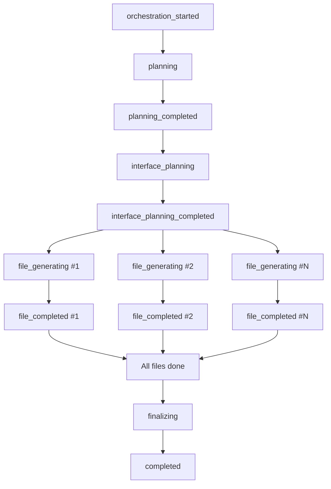

## Overview

Subscribe to real-time generation progress using Server-Sent Events (SSE). This endpoint streams updates as files are generated, providing a live view of the AI's work.

## Path Parameters

<ParamField path="website_id" type="string" required>
  The website_id (format: `{base_id}_v{version}`) to stream updates for
</ParamField>

## Connection

SSE connections are long-lived HTTP connections that stream data from server to client.

<CodeGroup>

```javascript JavaScript (EventSource)
const websiteId = '550e8400-e29b-41d4-a716-446655440000_v1';

const eventSource = new EventSource(
  `http://localhost:8001/sse/websites/${websiteId}`
);

eventSource.onmessage = (event) => {
  const data = JSON.parse(event.data);
  console.log(`[${data.type}]`, data.data);

  // Handle completion
  if (data.type === 'completed' || data.type === 'failed') {
    eventSource.close();
  }
};

eventSource.onerror = (error) => {
  console.error('SSE error:', error);
  eventSource.close();
};
```

```javascript JavaScript (Fetch)
const websiteId = '550e8400-e29b-41d4-a716-446655440000_v1';

const response = await fetch(
  `http://localhost:8001/sse/websites/${websiteId}`
);

const reader = response.body.getReader();
const decoder = new TextDecoder();

while (true) {
  const { value, done } = await reader.read();
  if (done) break;

  const chunk = decoder.decode(value);
  const lines = chunk.split('\n');

  for (const line of lines) {
    if (line.startsWith('data: ')) {
      const data = JSON.parse(line.slice(6));
      console.log(`[${data.type}]`, data.data);
    }
  }
}
```

```python Python (sseclient)
import json
import sseclient
import requests

website_id = '550e8400-e29b-41d4-a716-446655440000_v1'

response = requests.get(
    f'http://localhost:8001/sse/websites/{website_id}',
    stream=True
)

client = sseclient.SSEClient(response)

for event in client.events():
    data = json.loads(event.data)
    print(f"[{data['type']}]", data['data'])

    if data['type'] in ['completed', 'failed']:
        break
```

</CodeGroup>

## Event Types

### orchestration_started

Generation process begins.

```json
{
  "type": "orchestration_started",
  "data": {
    "website_id": "550e8400-e29b-41d4-a716-446655440000_v1",
    "message": "Starting React project generation"
  }
}
```

### planning

Project structure is being planned.

```json
{
  "type": "planning",
  "data": {
    "website_id": "550e8400-e29b-41d4-a716-446655440000_v1",
    "message": "Analyzing requirements and planning file structure"
  }
}
```

### planning_completed

File structure plan is ready.

```json
{
  "type": "planning_completed",
  "data": {
    "website_id": "550e8400-e29b-41d4-a716-446655440000_v1",
    "message": "Project plan created with 12 files",
    "file_count": 12,
    "files": [
      "package.json",
      "src/App.tsx",
      "src/components/Header.tsx",
      "src/components/Hero.tsx",
      "..."
    ]
  }
}
```

### interface_planning

Creating TypeScript type system (Phase 1).

```json
{
  "type": "interface_planning",
  "data": {
    "website_id": "550e8400-e29b-41d4-a716-446655440000_v1",
    "message": "Creating TypeScript interfaces and type definitions"
  }
}
```

### interface_planning_completed

Type system is ready.

```json
{
  "type": "interface_planning_completed",
  "data": {
    "website_id": "550e8400-e29b-41d4-a716-446655440000_v1",
    "message": "Created type system with 12 interface specifications",
    "interface_count": 12
  }
}
```

### file_generating

A specific file is being generated.

```json
{
  "type": "file_generating",
  "data": {
    "website_id": "550e8400-e29b-41d4-a716-446655440000_v1",
    "file_path": "src/components/Header.tsx",
    "message": "Generating src/components/Header.tsx"
  }
}
```

### file_completed

A file has been generated and saved.

```json
{
  "type": "file_completed",
  "data": {
    "website_id": "550e8400-e29b-41d4-a716-446655440000_v1",
    "file_path": "src/components/Header.tsx",
    "file_type": "typescript",
    "message": "✓ src/components/Header.tsx completed",
    "size_bytes": 1850,
    "tokens": 420
  }
}
```

### finalizing

Aggregating metadata and finishing up.

```json
{
  "type": "finalizing",
  "data": {
    "website_id": "550e8400-e29b-41d4-a716-446655440000_v1",
    "message": "Finalizing project generation"
  }
}
```

### completed

Generation completed successfully!

```json
{
  "type": "completed",
  "data": {
    "website_id": "550e8400-e29b-41d4-a716-446655440000_v1",
    "message": "React project generation completed successfully!",
    "file_count": 12,
    "total_tokens": 8500,
    "duration_seconds": 45
  }
}
```

### failed

Generation failed with an error.

```json
{
  "type": "failed",
  "data": {
    "website_id": "550e8400-e29b-41d4-a716-446655440000_v1",
    "message": "Generation failed",
    "error": "OpenAI API rate limit exceeded"
  }
}
```

## Complete Event Flow



Note: Multiple files generate in parallel (Phase 2), so you'll receive interleaved `file_generating` and `file_completed` events.

## Building a Progress UI

Here's a complete example of building a progress UI:

```javascript
class GenerationProgressTracker {
  constructor(websiteId) {
    this.websiteId = websiteId;
    this.files = [];
    this.completedFiles = 0;
    this.totalFiles = 0;
    this.eventSource = null;
  }

  start(onUpdate) {
    this.eventSource = new EventSource(
      `http://localhost:8001/sse/websites/${this.websiteId}`
    );

    this.eventSource.onmessage = (event) => {
      const { type, data } = JSON.parse(event.data);

      switch (type) {
        case 'planning_completed':
          this.totalFiles = data.file_count;
          this.files = data.files.map(path => ({
            path,
            status: 'pending'
          }));
          break;

        case 'file_generating':
          const genFile = this.files.find(f => f.path === data.file_path);
          if (genFile) genFile.status = 'generating';
          break;

        case 'file_completed':
          const compFile = this.files.find(f => f.path === data.file_path);
          if (compFile) {
            compFile.status = 'completed';
            compFile.tokens = data.tokens;
            this.completedFiles++;
          }
          break;

        case 'completed':
        case 'failed':
          this.eventSource.close();
          break;
      }

      // Notify UI
      onUpdate({
        type,
        data,
        progress: this.totalFiles > 0
          ? (this.completedFiles / this.totalFiles) * 100
          : 0,
        files: this.files
      });
    };
  }

  stop() {
    if (this.eventSource) {
      this.eventSource.close();
    }
  }
}

// Usage
const tracker = new GenerationProgressTracker(websiteId);

tracker.start((update) => {
  console.log(`Progress: ${update.progress.toFixed(1)}%`);
  console.log(`Event: ${update.type}`);

  // Update your UI here
  updateProgressBar(update.progress);
  updateFileList(update.files);
});
```

## Error Handling

```javascript
const eventSource = new EventSource(
  `http://localhost:8001/sse/websites/${websiteId}`
);

eventSource.onerror = (error) => {
  console.error('SSE Connection Error:', error);

  // Attempt reconnection (EventSource does this automatically)
  // Or manually reconnect after a delay:
  setTimeout(() => {
    eventSource.close();
    // Create new connection
  }, 5000);
};
```

## Browser Support

EventSource API is supported in all modern browsers. For older browsers, use a polyfill like [event-source-polyfill](https://www.npmjs.com/package/event-source-polyfill).

## Best Practices

1. **Always close connections**: Close EventSource when done to free resources
2. **Handle reconnection**: EventSource automatically reconnects on disconnect
3. **Use timeouts**: Set a timeout to close connection if no updates for too long
4. **Parse carefully**: Always validate JSON before parsing
5. **Update UI efficiently**: Batch UI updates to avoid performance issues
